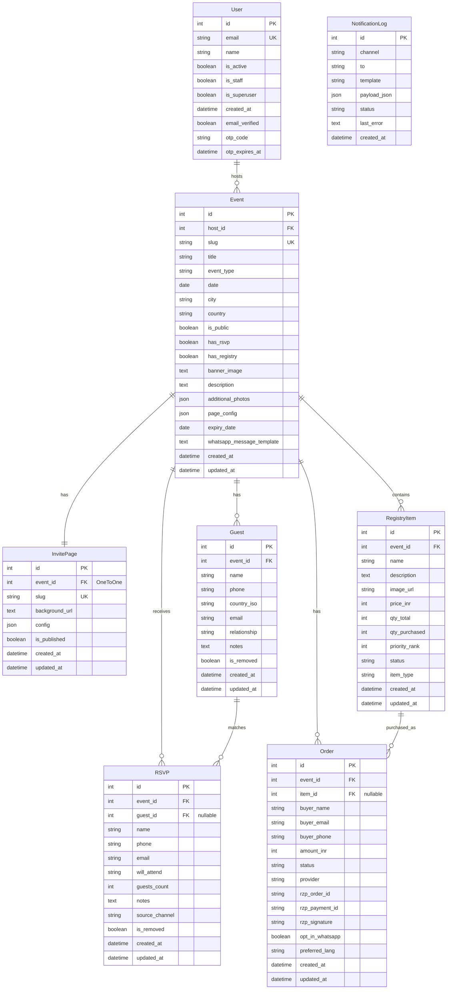

# Database Relationship Diagram

## Entity Relationship Diagram

## Relationship Summary

### Core Relationships

1. **User → Event** (One-to-Many)
   - A User can host multiple Events
   - Each Event belongs to one User (host)
   - Foreign Key: `Event.host_id` → `User.id`

2. **Event → InvitePage** (One-to-One)
   - Each Event has exactly one InvitePage
   - Each InvitePage belongs to one Event
   - Foreign Key: `InvitePage.event_id` → `Event.id`

3. **Event → Guest** (One-to-Many)
   - An Event can have many Guests
   - Each Guest belongs to one Event
   - Foreign Key: `Guest.event_id` → `Event.id`
   - Unique Constraint: `(event_id, phone)`

4. **Event → RSVP** (One-to-Many)
   - An Event can receive many RSVPs
   - Each RSVP belongs to one Event
   - Foreign Key: `RSVP.event_id` → `Event.id`
   - Unique Constraint: `(event_id, phone)`

5. **Event → RegistryItem** (One-to-Many)
   - An Event can have many RegistryItems
   - Each RegistryItem belongs to one Event
   - Foreign Key: `RegistryItem.event_id` → `Event.id`

6. **Event → Order** (One-to-Many)
   - An Event can have many Orders
   - Each Order belongs to one Event
   - Foreign Key: `Order.event_id` → `Event.id`

### Cross-Entity Relationships

7. **Guest → RSVP** (One-to-Many, Optional)
   - A Guest can have multiple RSVPs (if they update their response)
   - An RSVP can optionally be linked to a Guest (if the RSVP matches an invited guest)
   - Foreign Key: `RSVP.guest_id` → `Guest.id` (nullable)

8. **RegistryItem → Order** (One-to-Many, Optional)
   - A RegistryItem can have many Orders (multiple purchases)
   - An Order can optionally be linked to a RegistryItem (for physical gifts)
   - Foreign Key: `Order.item_id` → `RegistryItem.id` (nullable)
   - Note: Orders can exist without items (for cash gifts or donations)

### Standalone Entities

9. **NotificationLog**
   - No foreign key relationships
   - Standalone logging table for email/WhatsApp notifications

## Key Constraints

- **Unique Constraints:**
  - `User.email` - unique
  - `Event.slug` - unique
  - `InvitePage.slug` - unique
  - `(Event, phone)` - unique for Guest
  - `(Event, phone)` - unique for RSVP

- **Soft Deletes:**
  - `Guest.is_removed` - soft delete flag
  - `RSVP.is_removed` - soft delete flag

- **Nullable Foreign Keys:**
  - `RSVP.guest_id` - nullable (RSVP can exist without matching Guest)
  - `Order.item_id` - nullable (Orders for cash/donations don't need items)

## Database Tables

All models use custom table names:
- `users` (User)
- `events` (Event)
- `invite_pages` (InvitePage)
- `guests` (Guest)
- `rsvps` (RSVP)
- `registry_items` (RegistryItem)
- `orders` (Order)
- `notification_logs` (NotificationLog)

